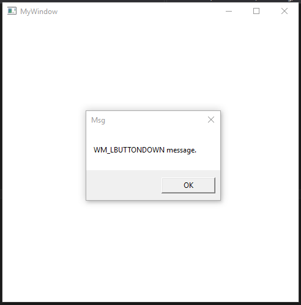

2. Your Second Windows Program
==============================

 

This program demonstrates a simple Windows program, it outputs a window with a
caption “My Window”, with a minimise, maximise and close button. It also
responds to Windows messages. In this instance if you click the ‘Left Mouse
Button’ - (’LMB’) inside the client window area, a message box will be displayed
telling you so. You can also close this message box using the close button (’X’)
or by pressing the ‘Esc’ key.

 

The code is heavily commented and should explain the program.

 

Here is an image of the rendered output, after clicking the ‘LMB’.

 

